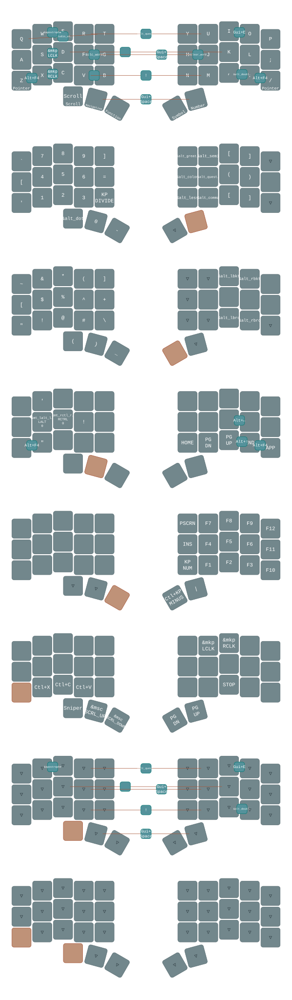

# ZMK Configuration

ZMK configuration for [Charybdis Nano](https://github.com/Bastardkb/Charybdis/tree/main) wireless version with [nice!nano](https://nicekeyboards.com/nice-nano/).

## Battery Tray (`battery_tray.pyw`)

*Available in [Release 2](../../releases/tag/v2.0)*

Windows system tray script that displays battery levels of both keyboard halves in real time. Reads battery data from the dongle via USB HID (Usage Page 0x84, Report IDs 0x05/0x06).

### Requirements

- Python 3
- Libraries: `hidapi`, `pystray`, `Pillow`
- Administrator privileges (required for HID access)

### Configuration

- `VID = 0x1D50`, `PID = 0x615E` — dongle USB identifiers
- `SWAP_HALVES = True/False` — swap left/right if they appear reversed after reflashing

### How it works

The script identifies keyboard halves by HID Report ID, not by USB device enumeration order. This prevents left/right confusion after firmware updates.
Battery levels are polled every 30 seconds and displayed as a tray icon.

### Known limitations

- Shows 100% when a half is connected to USB for charging (hardware limitation of MCP73831 charge circuit)
- Shows 0% when a half is in deep sleep and not responding to BLE requests

